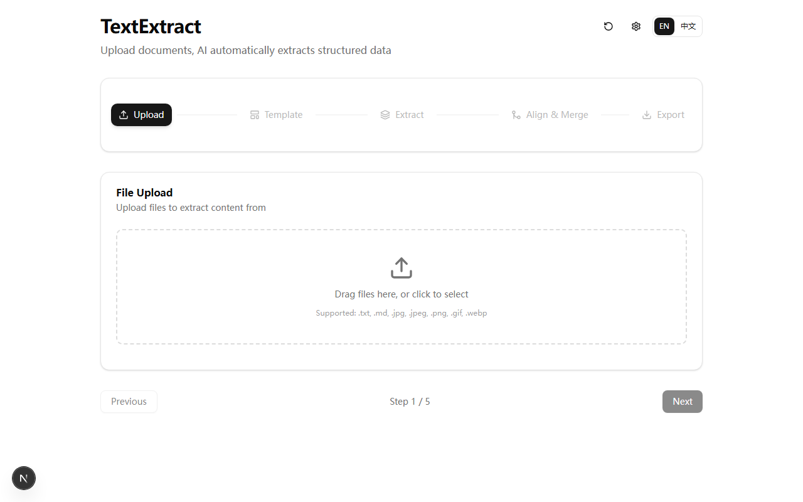

<p align="center">
  <h1 align="center">TextExtract</h1>
  <p align="center">
    <strong>AI-Powered Document OCR Extraction Tool</strong><br/>
    Extract structured data from images, PDFs, DOCX, XLSX, and more with AI vision models.
  </p>
</p>

<p align="center">
  
  
  
  
  
</p>

---

## Features

- **Multi-format Support** — Images (PNG, JPG, BMP, TIFF, WebP, GIF), PDF, DOCX, XLSX, CSV, TXT, Markdown
- **AI Extraction** — Images processed by multimodal vision models; text-based files (PDF, DOCX, XLSX) parsed and sent as text context
- **5-Step Wizard** — Upload → Template → Extract → Align & Merge → Export
- **Smart Grouping** — Automatically groups files by naming patterns (patient ID, date, etc.)
- **Template System** — Define output columns with AI-assisted template generation, preset templates included
- **Batch Processing** — Dynamic batch sizing, real-time progress with ETA
- **Session Recovery** — Resume interrupted extractions via IndexedDB + localStorage persistence
- **Pivot Export** — Transform long-format data to wide-format tables
- **Flexible Export** — XLSX, CSV, JSON with row/column selection
- **Bilingual UI** — English & Chinese interface
- **Desktop App** — Package as Windows desktop application via Electron

## Screenshots

| Upload | Template Preset |
|:---:|:---:|
|  |  |

| Template Configured | Extracting |
|:---:|:---:|
|  |  |

| Extraction Done | Align & Merge |
|:---:|:---:|
|  |  |

| Export | Settings |
|:---:|:---:|
|  |  |

## Quick Start

### Prerequisites

- **Node.js** >= 18
- **npm** >= 9
- **A multimodal AI model API key** (see [Important: Multimodal Model Required](#important-multimodal-model-required))

### Install & Run

```bash
git clone https://github.com/Liozhang/TextExtract.git
cd TextExtract
npm install
cp .env.example .env    # Configure your API key
npm run dev
```

Open [http://localhost:3000](http://localhost:3000) in your browser.

### Environment Configuration

Create a `.env` file in the project root (or configure via the in-app Settings dialog):

```env
API_BASE_URL=https://api.stepfun.com/step_plan/v1
API_KEY=sk-your-api-key
API_MODEL=step-3.7-flash
API_CONCURRENCY=5
API_TIMEOUT=120000
IMAGE_COMPRESS_THRESHOLD=20
```

All settings can also be configured in-app via the Settings (gear icon) in the top-right corner.

## Important: Multimodal Model Required

**TextExtract sends document images to the AI model for visual content extraction.** You MUST use a model that supports **image/vision input**.

| Model | Vision Support | Notes |
|-------|:-:|-------|
| **step-3.7-flash** | Yes | **Recommended** — default multimodal model for document OCR |
| GPT-3.5 / GPT-4 (text-only) | **No** | Will NOT work |

If you see extraction errors or empty results, double-check that your model supports image input.

### Configuring Custom API Providers

TextExtract works with any OpenAI-compatible API endpoint. Set the base URL to your provider:

```env
# StepFun (recommended)
API_BASE_URL=https://api.stepfun.com/step_plan/v1
API_MODEL=step-3.7-flash
```

## Usage

### 5-Step Workflow

1. **Upload Files** — Drag & drop or click to upload documents. Supports up to 500 files, 100MB each.

2. **Configure Template** — Define which fields to extract. Use presets, paste headers, type manually, or let AI generate a template from your description.

3. **Extract** — AI reads each document image and extracts structured data. Real-time progress with batch processing and ETA.

4. **Align & Merge** — Groups related files together, merges extracted fields, and aligns to your template columns.

5. **Export Results** — Download as XLSX, CSV, or JSON. Filter rows/columns, or use pivot mode for wide-format output.

### Preset Templates

A built-in clinical report template is included covering:
- Patient info (bed number, name, gender, age, etc.)
- Lab results, pathology descriptions, imaging findings
- Reference ranges, abnormal markers, specimen types

## Build Desktop App

```bash
npm run electron:build
```

Output: `dist-electron/output/Message Extract Setup 0.2.0.exe`

> Requires Electron mirrors for faster downloads (pre-configured for npmmirror).

## Tech Stack

| Category | Technology |
|----------|-----------|
| Framework | Next.js 16 (App Router, Turbopack) |
| UI | React 19, Tailwind CSS 4, Radix UI |
| State | Zustand 5 with persistence |
| AI | OpenAI SDK (compatible with any multimodal API) |
| File Parsing | mammoth (DOCX), pdf-parse (PDF), sharp (images) |
| Export | SheetJS (XLSX/CSV) |
| Desktop | Electron 42 |
| Language | TypeScript 5 |

## Project Structure

```
src/
├── app/                    # Next.js App Router
│   ├── api/
│   │   ├── extract/        # SSE streaming extraction API
│   │   ├── align-merge/    # SSE streaming merge/align API
│   │   ├── export/         # File export API
│   │   ├── upload/         # Chunked file upload API
│   │   ├── generate-template/ # AI template generation
│   │   └── settings/       # API settings endpoint
│   ├── layout.tsx
│   └── page.tsx             # Main 5-step wizard page
├── components/
│   ├── ui/                  # Radix UI + Tailwind components
│   ├── file-upload-panel.tsx
│   ├── template-panel.tsx
│   ├── extraction-panel.tsx
│   ├── align-merge-panel.tsx
│   ├── export-panel.tsx
│   └── ...                  # Supporting components
├── lib/
│   ├── store.ts             # Zustand global state
│   ├── pipeline/            # AI pipeline (prompts, merge agent)
│   ├── pipeline-helpers.tsx # SSE parsing, result cards
│   ├── preset-templates.ts  # Built-in templates
│   ├── i18n.ts              # English/Chinese translations
│   ├── idb-storage.ts       # IndexedDB session persistence
│   └── pivot.ts             # Long-to-wide data transformation
└── electron/                # Electron main process
```

## License

This project is licensed under the MIT License.

## Author

**Liozh** — [github.com/Liozhang](https://github.com/Liozhang)
