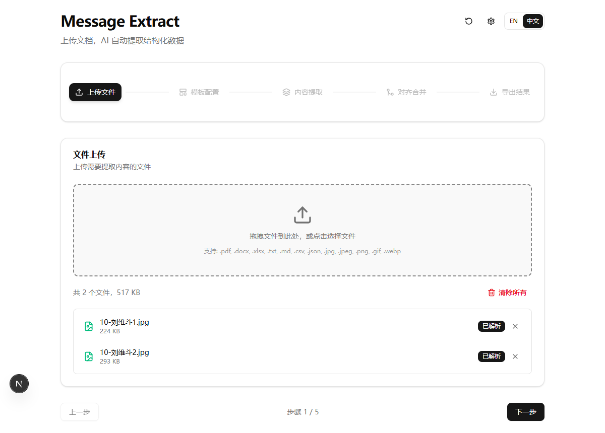
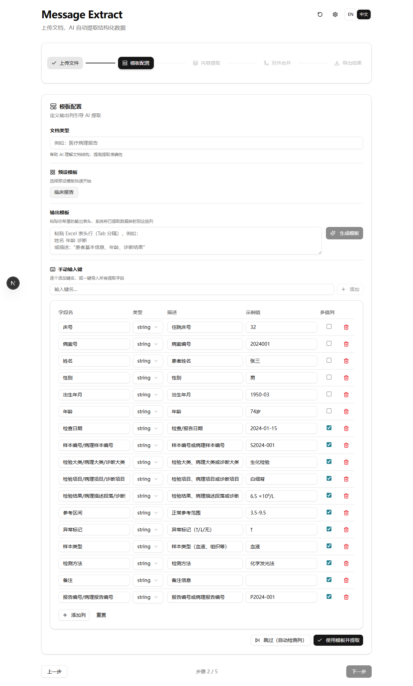
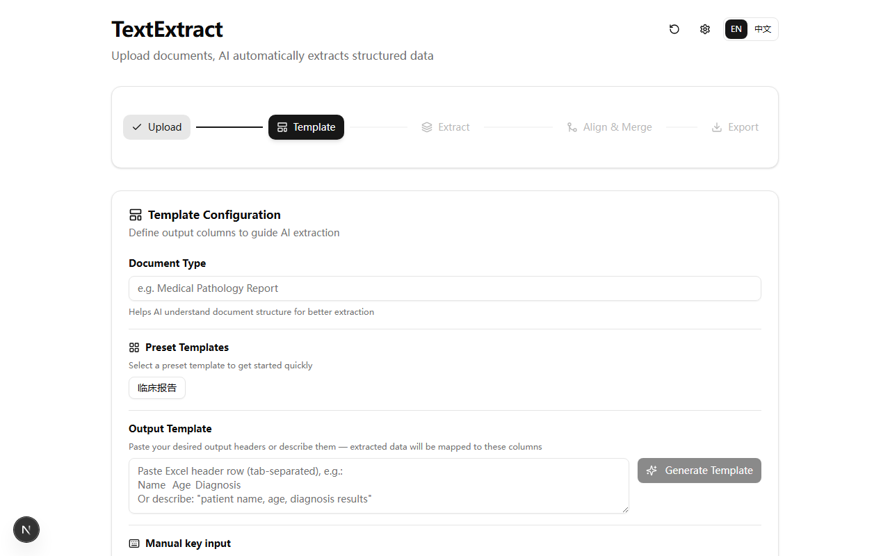
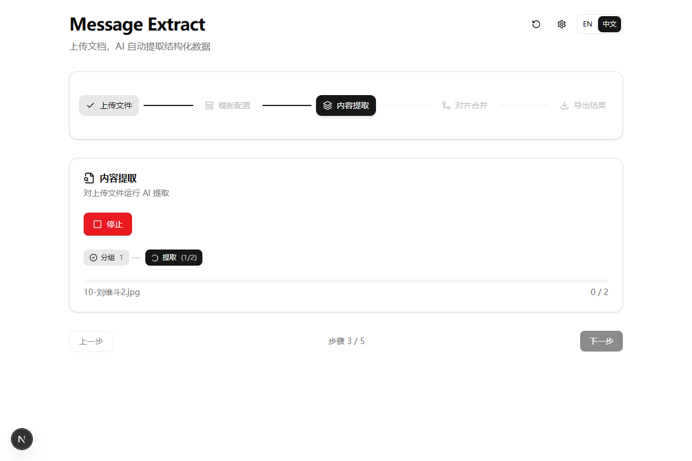
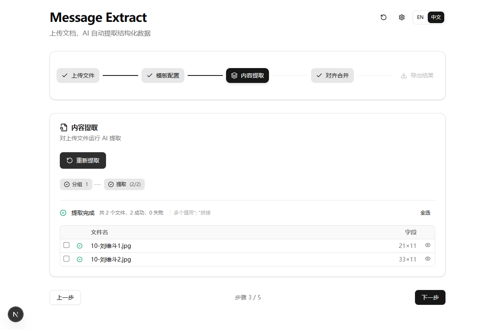
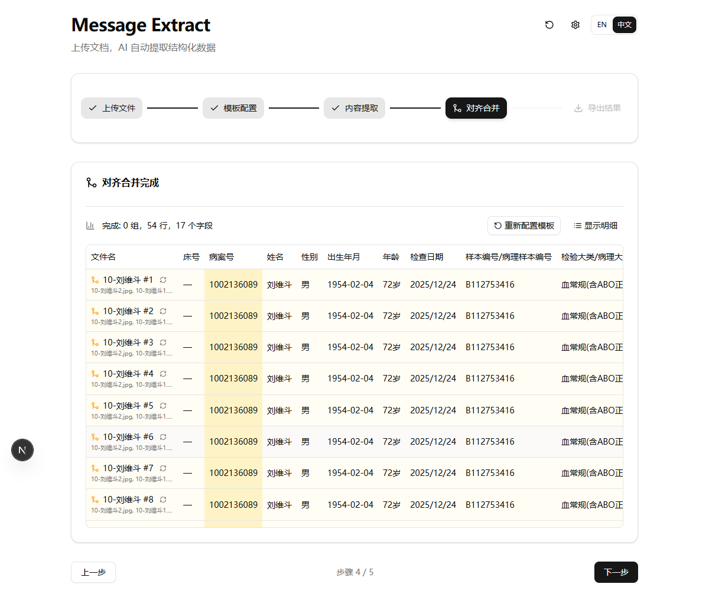
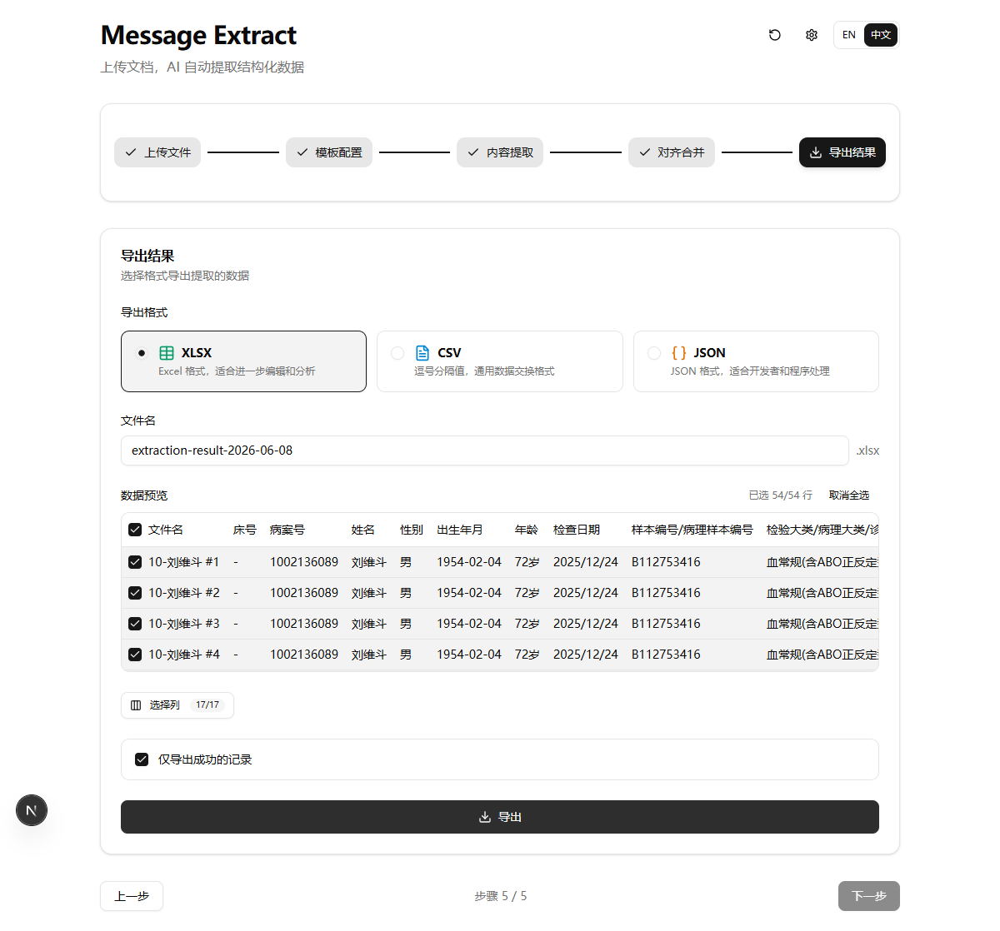
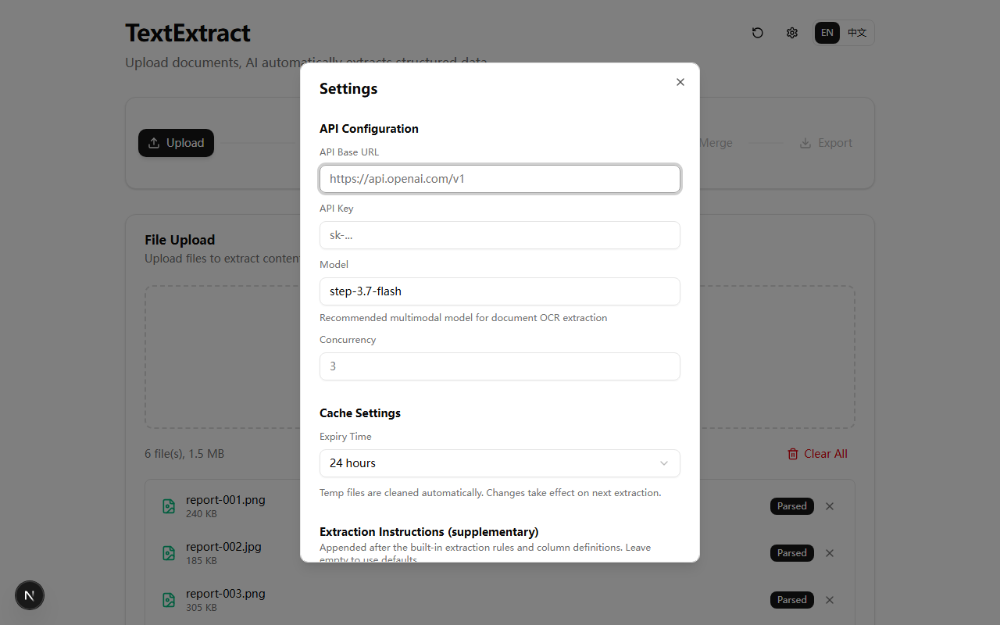

<p align="center">
  <h1 align="center">TextExtract</h1>
  <p align="center">
    <strong>AI 驱动的文档智能提取工具</strong><br/>
    利用多模态大模型，从图片、PDF、Word 等文档中提取结构化数据。
  </p>
</p>

<p align="center">
  
  
  
  
  
</p>

[English](./README.md) | 中文

---

## 功能特性

- **多格式支持** — 图片（PNG、JPG、BMP、TIFF、WebP、GIF）、PDF、DOCX、XLSX、CSV、TXT、Markdown
- **AI 智能提取** — 图片通过多模态视觉模型识别；文本类文件（PDF、DOCX、XLSX）解析后作为文本上下文发送
- **5 步向导** — 上传文件 → 配置模板 → 内容提取 → 对齐合并 → 导出结果
- **智能分组** — 根据文件名模式自动归类（患者 ID、日期等）
- **模板系统** — 自定义输出列，支持 AI 辅助生成模板，内置临床报告预设模板
- **批量处理** — 动态批次大小，实时进度显示与 ETA 预估
- **会话恢复** — 中断后可通过 IndexedDB + localStorage 恢复提取进度
- **透视导出** — 长格式数据一键转换为宽格式表格
- **灵活导出** — 支持 XLSX、CSV、JSON，可选择行/列
- **中英双语** — 中文与英文界面切换
- **桌面应用** — 通过 Electron 打包为 Windows 桌面应用

## 截图

| 上传文件 | 模板预设 |
|:---:|:---:|
|  |  |

| 模板确认 | 提取中 |
|:---:|:---:|
|  |  |

| 提取完成 | 对齐合并 |
|:---:|:---:|
|  |  |

| 导出结果 | 设置 |
|:---:|:---:|
|  |  |

## 快速开始

### 环境要求

- **Node.js** >= 18
- **npm** >= 9
- **多模态大模型 API 密钥**（参见下方[重要提示](#重要提示必须使用支持视觉的多模态模型)）

### 安装与运行

```bash
git clone https://github.com/Liozhang/TextExtract.git
cd TextExtract
npm install
cp .env.example .env    # 配置你的 API 密钥
npm run dev
```

在浏览器中打开 [http://localhost:3000](http://localhost:3000)。

### 环境变量配置

在项目根目录创建 `.env` 文件（也可在应用内通过设置对话框配置）：

```env
API_BASE_URL=https://api.stepfun.com/step_plan/v1
API_KEY=sk-your-api-key
API_MODEL=step-3.7-flash
API_CONCURRENCY=5
API_TIMEOUT=120000
IMAGE_COMPRESS_THRESHOLD=20
```

所有设置均可通过应用右上角齿轮图标（设置）进行在线配置。

## 重要提示：必须使用支持视觉的多模态模型

**TextExtract 会将文档图片发送给 AI 模型进行视觉内容识别。** 你必须使用支持**图片/视觉输入**的模型。

| 模型 | 视觉支持 | 备注 |
|------|:---:|------|
| **step-3.7-flash** | 是 | **推荐** — 默认多模态模型，适用于文档 OCR 提取 |
| GPT-3.5 / GPT-4（纯文本） | **否** | 无法使用 |

如果提取时报错或结果为空，请首先检查所使用的模型是否支持图片输入。

### 配置自定义 API 供应商

TextExtract 兼容任何 OpenAI 接口格式的 API 端点。设置 Base URL 为你的供应商地址：

```env
# 阶跃星辰（推荐）
API_BASE_URL=https://api.stepfun.com/step_plan/v1
API_MODEL=step-3.7-flash
```

## 使用说明

### 5 步工作流

1. **上传文件** — 拖拽或点击上传文档。支持最多 500 个文件，单文件最大 100MB。

2. **配置模板** — 定义需要提取的字段。可使用预设模板、粘贴表头、手动输入，或让 AI 根据描述自动生成模板。

3. **内容提取** — AI 读取每个文档并提取结构化数据。支持批量处理，实时显示进度和预计剩余时间。

4. **对齐合并** — 将相关文件自动分组，合并提取字段，对齐到模板列。

5. **导出结果** — 下载为 XLSX、CSV 或 JSON。支持行列筛选，或使用透视模式转为宽格式。

### 内置预设模板

内置临床报告模板，覆盖以下字段：
- 患者信息（床号、姓名、性别、年龄等）
- 检验结果、病理描述、影像所见
- 参考区间、异常标记、样本类型、检测方法

## 构建桌面应用

```bash
npm run electron:build
```

输出：`dist-electron/output/Message Extract Setup 0.2.0.exe`

> 已配置 npmmirror 镜像加速 Electron 下载。

## 技术栈

| 类别 | 技术 |
|------|------|
| 框架 | Next.js 16（App Router、Turbopack） |
| UI | React 19、Tailwind CSS 4、Radix UI |
| 状态管理 | Zustand 5（带持久化） |
| AI | OpenAI SDK（兼容任何多模态 API） |
| 文件解析 | mammoth（DOCX）、pdf-parse（PDF）、sharp（图片压缩） |
| 导出 | SheetJS（XLSX/CSV） |
| 桌面端 | Electron 42 |
| 语言 | TypeScript 5 |

## 项目结构

```
src/
├── app/                    # Next.js App Router
│   ├── api/
│   │   ├── extract/        # SSE 流式提取 API
│   │   ├── align-merge/    # SSE 流式合并/对齐 API
│   │   ├── export/         # 文件导出 API
│   │   ├── upload/         # 分块文件上传 API
│   │   ├── generate-template/ # AI 模板生成
│   │   └── settings/       # API 设置端点
│   ├── layout.tsx
│   └── page.tsx             # 主 5 步向导页面
├── components/
│   ├── ui/                  # Radix UI + Tailwind 基础组件
│   ├── file-upload-panel.tsx   # 文件上传面板
│   ├── template-panel.tsx      # 模板配置面板
│   ├── extraction-panel.tsx    # 内容提取面板
│   ├── align-merge-panel.tsx   # 对齐合并面板
│   ├── export-panel.tsx        # 导出结果面板
│   └── ...                      # 其他辅助组件
├── lib/
│   ├── store.ts             # Zustand 全局状态
│   ├── pipeline/            # AI 处理管线（prompts、merge agent）
│   ├── pipeline-helpers.tsx # SSE 解析、结果卡片
│   ├── preset-templates.ts  # 内置预设模板
│   ├── i18n.ts              # 中英文翻译
│   ├── idb-storage.ts       # IndexedDB 会话持久化
│   └── pivot.ts             # 长格式转宽格式
└── electron/                # Electron 主进程
```

## 许可证

本项目基于 MIT 许可证开源。

## 作者

**Liozh** — [github.com/Liozhang](https://github.com/Liozhang)
